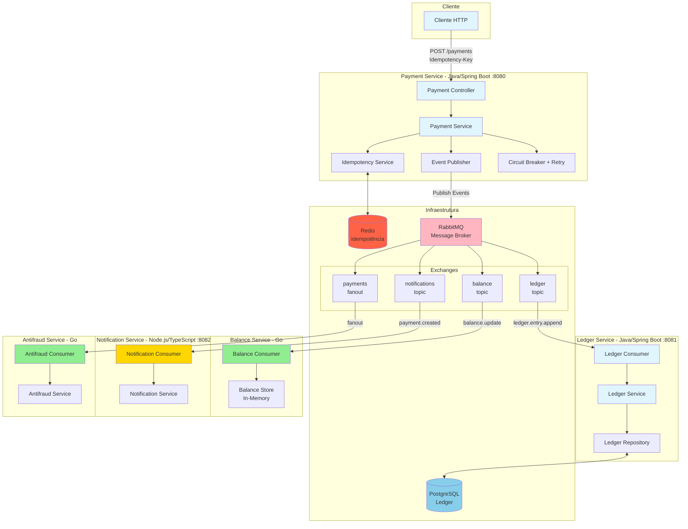
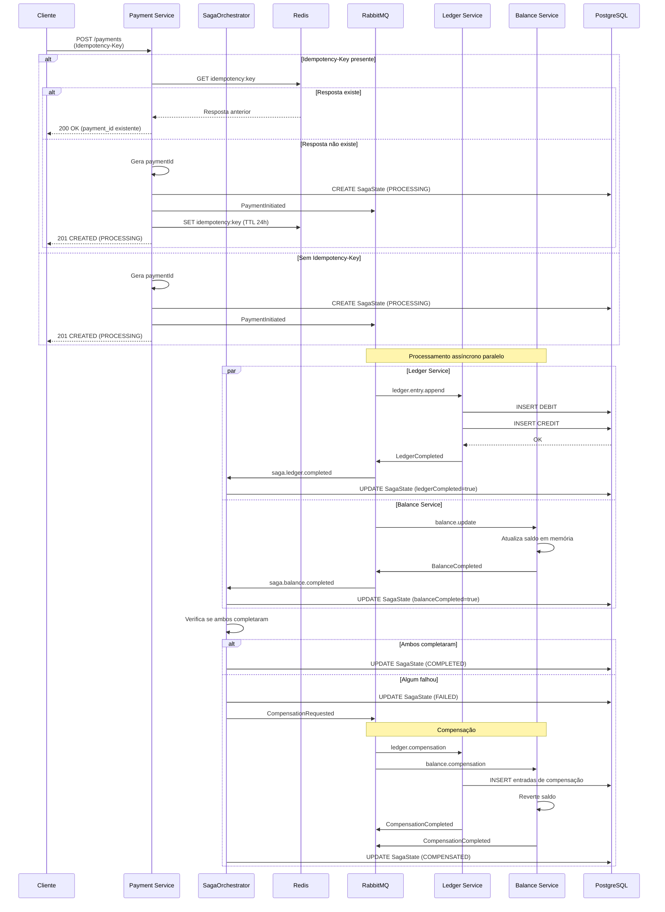

# Aula 5 — Sistema de Pagamentos com Arquitetura de Microsserviços

## Índice

1. [Visão Geral](#visão-geral)
2. [Linguagens e Tecnologias](#linguagens-e-tecnologias)
3. [Padrões Arquiteturais](#padrões-arquiteturais)
4. [Arquitetura do Sistema](#arquitetura-do-sistema)
5. [Fluxo Completo de Processamento](#fluxo-completo-de-processamento)
6. [Como Executar](#como-executar)
7. [Como Visualizar e Monitorar](#como-visualizar-e-monitorar)
8. [Testando o Sistema](#testando-o-sistema)
9. [Troubleshooting](#troubleshooting)

---

## Visão Geral

Este projeto demonstra uma **arquitetura de microsserviços** para processamento de pagamentos, implementando comunicação assíncrona baseada em eventos, baixo acoplamento e resiliência. Cada serviço utiliza a tecnologia mais adequada para seu domínio específico.

### Objetivos do Projeto

- Comunicação assíncrona via eventos (RabbitMQ)
- Baixo acoplamento entre serviços
- Resiliência com Circuit Breaker e Retry
- Idempotência para evitar processamento duplicado
- Observabilidade completa (métricas, traces, logs)
- Tecnologias otimizadas para cada domínio

---

## Linguagens e Tecnologias

### Por Serviço

| Serviço | Linguagem | Framework/Stack | Porta | Justificativa |
|---------|-----------|-----------------|-------|---------------|
| **Payment Service** | Java 17 | Spring Boot 3.2 | 8080 | Framework robusto, rico em features (Resilience4j, Spring Data Redis) |
| **Ledger Service** | Java 17 | Spring Boot 3.2 | 8081 | JPA para persistência complexa, transações ACID |
| **Balance Service** | Go 1.22 | Go puro | - | Alta concorrência, baixa latência, atualização rápida em memória |
| **Notification Service** | TypeScript | Node.js 20 + Express | 8082 | I/O bound, ideal para integrações externas (email, SMS, webhooks) |
| **Antifraud Service** | Go 1.22 | Go puro | - | Processamento rápido, validações em tempo real |

### Infraestrutura

- **RabbitMQ**: Message broker para comunicação assíncrona
- **Redis**: Cache para idempotência
- **PostgreSQL**: Banco de dados relacional para ledger (entradas imutáveis)
- **Prometheus**: Coleta de métricas
- **Grafana**: Visualização de métricas
- **Jaeger**: Distributed tracing
- **Zipkin**: Distributed tracing (alternativa)

---

## Padrões Arquiteturais

### 1. **Event-Driven Architecture (EDA)**
- Comunicação assíncrona via eventos
- Serviços desacoplados (não conhecem uns aos outros)
- Sistema continua funcionando mesmo se consumidores estiverem offline

### 2. **Microservices Architecture**
- Cada serviço é independente e pode ser desenvolvido/deployado separadamente
- Tecnologia específica para cada domínio

### 3. **CQRS (Command Query Responsibility Segregation)**
- **Command**: Payment Service recebe comandos (POST /payments)
- **Query**: Balance Service mantém projeção de saldos em memória (read model)
- **Event Sourcing parcial**: Ledger Service armazena eventos imutáveis

### 4. **Circuit Breaker Pattern**
- Implementado com Resilience4j no Payment Service
- Protege contra falhas em cascata
- Fallback quando o circuito está aberto

### 5. **Retry Pattern**
- Tentativas automáticas em caso de falha temporária
- Implementado com Resilience4j

### 6. **Idempotency Pattern**
- Evita processamento duplicado de requisições
- Usa Redis para armazenar respostas
- Header `Idempotency-Key` opcional

### 7. **Publisher-Subscriber Pattern**
- Payment Service publica eventos
- Outros serviços se inscrevem e consomem eventos

### 8. **Fanout Exchange**
- Antifraud Service recebe todos os eventos de pagamento
- Útil para múltiplos consumidores do mesmo evento

### 9. **SAGA Pattern (Choreography)**
- **Orquestração distribuída** via eventos para transações distribuídas
- **Compensação automática** em caso de falha
- **Estados rastreados** no banco de dados (SagaState)
- **Eventos de sucesso/falha** publicados por cada serviço
- **Coordenação assíncrona** sem bloqueio

#### Como funciona:
1. Payment Service cria `SagaState` com status `PROCESSING`
2. Publica evento `PaymentInitiated` que dispara processamento paralelo
3. Cada serviço (Ledger, Balance) publica eventos de sucesso/falha
4. `SagaOrchestrator` monitora eventos e atualiza estado
5. Se algum serviço falhar, inicia compensação automática
6. Serviços que já completaram recebem eventos de compensação
7. Estado final: `COMPLETED` ou `COMPENSATED`

#### Estados da SAGA:
- `PENDING` → `PROCESSING` → `COMPLETED` (sucesso)
- `PROCESSING` → `FAILED` → `COMPENSATING` → `COMPENSATED` (falha com compensação)

---

## Arquitetura do Sistema

### Diagrama de Componentes



### Fluxo de Dados

1. **Cliente** → Payment Service (HTTP REST)
2. **Payment Service** → Redis (verifica idempotência)
3. **Payment Service** → RabbitMQ (publica 4 eventos)
4. **RabbitMQ** → Ledger Service (consome evento)
5. **RabbitMQ** → Balance Service (consome evento)
6. **RabbitMQ** → Notification Service (consome evento)
7. **RabbitMQ** → Antifraud Service (consome evento)

---

## Fluxo Completo de Processamento

### Passo a Passo Detalhado

#### 1. **Cliente faz requisição**
```http
POST http://localhost:8080/payments
Content-Type: application/json
Idempotency-Key: unique-key-123

{
  "accountId": "acc-123",
  "amount": 100.50,
  "currency": "BRL"
}
```

#### 2. **Payment Service recebe a requisição**
- Controller valida o JSON
- Chama `PaymentService.processPayment()`

#### 3. **Verificação de Idempotência** (se `Idempotency-Key` presente)
- Consulta Redis com chave `idempotency:unique-key-123`
- Se existe resposta anterior → retorna imediatamente (200 OK)
- Se não existe → continua processamento

#### 4. **Geração de Payment ID e Criação da SAGA**
- Gera UUID único para o pagamento
- Cria `SagaState` no PostgreSQL com status `PROCESSING`
- Armazena informações do pagamento para rastreamento

#### 5. **Publicação de Evento PaymentInitiated (SAGA)**
Payment Service publica evento `PaymentInitiated` que dispara processamento paralelo:

| Exchange | Tipo | Routing Key | Consumidor |
|----------|------|-------------|------------|
| `saga` | topic | `payment.initiated` | SagaOrchestrator |
| `ledger` | topic | `entry.append` | Ledger Service |
| `balance` | topic | `update` | Balance Service |
| `notifications` | topic | `payment.created` | Notification Service |
| `payments` | fanout | (sem routing key) | Antifraud Service |

#### 6. **Armazenamento para Idempotência**
- Se `Idempotency-Key` presente, armazena resposta no Redis (TTL: 24h)

#### 7. **Resposta Imediata ao Cliente**
```json
HTTP 201 CREATED
{
  "paymentId": "550e8400-e29b-41d4-a716-446655440000",
  "status": "PROCESSING"
}
```

**Importante**: O cliente recebe a resposta **antes** dos serviços consumidores processarem os eventos! O status é `PROCESSING` porque a SAGA ainda está em execução.

#### 8. **Processamento Assíncrono Paralelo**

##### 8.1. **Ledger Service** (Java) - Com SAGA
- Consome evento do exchange `ledger` com routing key `entry.append`
- Cria **2 entradas imutáveis** no PostgreSQL:
  - **DEBIT**: Conta origem (diminui saldo)
  - **CREDIT**: Conta destino (aumenta saldo)
- Princípio de **dupla entrada** (double-entry bookkeeping)
- **Publica evento de sucesso**: `LedgerCompleted` → `saga.ledger.completed`
- **Em caso de falha**: Publica `LedgerFailed` → `saga.ledger.failed`
- Log: `"Ledger entry processed successfully"`

##### 8.2. **Balance Service** (Go) - Com SAGA
- Consome evento do exchange `balance` com routing key `update`
- Atualiza saldo **em memória** (mapa thread-safe)
- **Armazena operação** para possível compensação
- Operação: `DEBIT` ou `CREDIT`
- **Publica evento de sucesso**: `BalanceCompleted` → `saga.balance.completed`
- **Em caso de falha**: Publica `BalanceFailed` → `saga.balance.failed`
- Log: `"Balance updated: accountId=acc-123, newBalance=100.50"`

##### 8.3. **SagaOrchestrator** (Payment Service)
- Monitora eventos de sucesso/falha dos serviços
- Atualiza `SagaState` conforme eventos chegam
- **Se ambos Ledger e Balance completarem**: Status → `COMPLETED`
- **Se algum falhar**: Status → `FAILED` → Inicia compensação
- Publica eventos de compensação para serviços que já completaram

##### 8.4. **Compensação (Rollback)**
Se algum serviço falhar:
- **SagaOrchestrator** detecta falha e muda status para `COMPENSATING`
- Publica eventos de compensação:
  - `ledger.compensation` → Ledger Service reverte entradas
  - `balance.compensation` → Balance Service reverte saldo
- Cada serviço processa compensação e publica `CompensationCompleted`
- Status final: `COMPENSATED`

##### 8.5. **Notification Service** (TypeScript)
- Consome evento do exchange `notifications` com routing key `payment.created`
- Simula envio de notificações:
  - Email
  - SMS
  - Push notification
  - Webhook
- Log: `"Notification sent: Payment {paymentId}..."`

##### 8.6. **Antifraud Service** (Go)
- Consome evento do exchange `payments` (fanout - recebe todos)
- Valida transação para detectar fraudes
- Processa de forma assíncrona (não bloqueia pagamento)
- Log: `{"service":"antifraud","event":"processed"}`

### Diagrama de Sequência com SAGA



---

## Como Executar

### Pré-requisitos

- **Docker** e **Docker Compose** instalados
- **Portas disponíveis**: 8080, 8081, 8082, 5432, 5672, 6379, 9090, 3000, 15672, 16686, 9411

### Passo 1: Verificar Docker

```bash
docker --version
docker compose version
```

### Passo 2: Clonar/Navegar até o projeto

```bash
cd "/Users/wheslley/Desktop/Fintech Dev/Aula 5/fintechdev-5"
```

### Passo 3: Subir todos os serviços

```bash
docker compose up --build
```

**O que acontece:**
1. Docker baixa/builda todas as imagens
2. Cria containers para:
   - RabbitMQ (message broker)
   - Redis (idempotência)
   - PostgreSQL (ledger)
   - Prometheus (métricas)
   - Grafana (dashboards)
   - Jaeger (tracing)
   - Zipkin (tracing)
   - Payment Service
   - Ledger Service
   - Balance Service
   - Notification Service
   - Antifraud Service

### Passo 4: Aguardar inicialização

Aguarde até ver logs indicando que todos os serviços estão prontos:

```
payment-service    | Started PaymentServiceApplication
ledger-service     | Started LedgerServiceApplication
balance-service    | balance-service listening for balance updates...
notification-service | Notification service listening for payment events...
antifraud-service   | {"service":"antifraud","event":"ready"}
```

**Tempo estimado**: 1-2 minutos na primeira execução

### Passo 5: Verificar saúde dos serviços

Em **outro terminal**, execute:

```bash
# Payment Service
curl http://localhost:8080/actuator/health

# Notification Service
curl http://localhost:8082/health
```

**Resposta esperada:**
```json
{"status":"UP"}
```

### Executar em Background

Para executar sem bloquear o terminal:

```bash
docker compose up --build -d
```

Para ver logs:
```bash
docker compose logs -f
```

Para parar:
```bash
docker compose down
```

---

## Como Visualizar e Monitorar

### 1. **RabbitMQ Management UI**

**URL**: http://localhost:15672

**Credenciais**:
- Usuário: `guest`
- Senha: `guest`

#### O que visualizar:

##### **Exchanges** (Abas → Exchanges)
Você verá 4 exchanges criados:
- `ledger` (tipo: topic)
- `balance` (tipo: topic)
- `notifications` (tipo: topic)
- `payments` (tipo: fanout)

##### **Queues** (Abas → Queues)
Filas criadas automaticamente:
- `ledger.entry.append` (consumida por Ledger Service)
- `balance.updates` (consumida por Balance Service)
- `notifications.payment.created` (consumida por Notification Service)
- Queue temporária para Antifraud Service

##### **Monitoramento em Tempo Real**
1. Vá em **Queues** → Clique em uma fila
2. Role até **Get messages**
3. Clique em **Get Message(s)** para ver mensagens na fila

##### **Verificar Consumidores**
- Aba **Queues** → Coluna **Consumers** mostra quantos consumidores estão ativos

### 2. **Logs dos Serviços**

#### Ver todos os logs
```bash
docker compose logs -f
```

#### Ver logs de um serviço específico
```bash
# Payment Service
docker compose logs -f payment-service

# Ledger Service
docker compose logs -f ledger-service

# Balance Service
docker compose logs -f balance-service

# Notification Service
docker compose logs -f notification-service

# Antifraud Service
docker compose logs -f antifraud-service
```

#### Exemplos de logs que você verá:

**Payment Service:**
```
payment-service | Payment processed successfully: paymentId=xxx, latency_ms=45
```

**Ledger Service:**
```
ledger-service | Ledger entry processed successfully: transactionId=xxx
```

**Balance Service:**
```
balance-service | Balance updated: accountId=acc-123, operation=DEBIT, amount=100.50, newBalance=-100.50
```

**Notification Service:**
```
notification-service | Notification sent: Payment xxx of 100.5 BRL for account acc-123
```

**Antifraud Service:**
```
antifraud-service | {"service":"antifraud","event":"processed","body":"{...}"}
```

### 3. **Prometheus**

**URL**: http://localhost:9090

#### Como usar:
1. Acesse http://localhost:9090
2. Vá em **Status** → **Targets** para ver serviços sendo monitorados
3. Use **Graph** para criar queries PromQL
4. Exemplo de query: `up` (mostra serviços online)

### 4. **Grafana**

**URL**: http://localhost:3000

**Credenciais padrão**:
- Usuário: `admin`
- Senha: `admin` (será solicitado mudança na primeira vez)

#### Configurar Prometheus como Data Source:
1. Acesse http://localhost:3000
2. Vá em **Configuration** → **Data Sources**
3. Clique em **Add data source**
4. Selecione **Prometheus**
5. URL: `http://prometheus:9090`
6. Clique em **Save & Test**

#### Criar Dashboard:
1. Vá em **Dashboards** → **New Dashboard**
2. Adicione painéis com métricas do Prometheus

### 5. **Jaeger**

**URL**: http://localhost:16686

#### Como usar:
1. Acesse http://localhost:16686
2. Selecione o serviço no dropdown
3. Clique em **Find Traces**
4. Veja traces distribuídos entre serviços

### 6. **Zipkin**

**URL**: http://localhost:9411

#### Como usar:
1. Acesse http://localhost:9411
2. Clique em **Run Query** para ver traces
3. Explore dependências entre serviços

### 7. **PostgreSQL**

Para verificar dados no ledger:

```bash
# Conectar ao PostgreSQL
docker compose exec postgres psql -U postgres -d ledger

# Ver tabelas
\dt

# Ver entradas do ledger
SELECT * FROM ledger_entry ORDER BY created_at DESC LIMIT 10;

# Sair
\q
```

---

## Testando o Sistema

### Teste 1: Criar um pagamento básico

```bash
curl -X POST http://localhost:8080/payments \
  -H "Content-Type: application/json" \
  -d '{
    "accountId": "acc-123",
    "amount": 100.50,
    "currency": "BRL"
  }'
```

**Resposta esperada:**
```json
{
  "paymentId": "550e8400-e29b-41d4-a716-446655440000",
  "status": "PROCESSING"
}
```

**O que verificar:**
1. Logs em todos os serviços processando o evento
2. RabbitMQ Management mostra mensagens sendo processadas
3. Entrada criada no PostgreSQL (Ledger Service)

### Teste 2: Testar idempotência

```bash
# Primeira requisição
curl -X POST http://localhost:8080/payments \
  -H "Content-Type: application/json" \
  -H "Idempotency-Key: test-123" \
  -d '{
    "accountId": "acc-123",
    "amount": 200.00,
    "currency": "BRL"
  }'

# Segunda requisição (mesma Idempotency-Key)
curl -X POST http://localhost:8080/payments \
  -H "Content-Type: application/json" \
  -H "Idempotency-Key: test-123" \
  -d '{
    "accountId": "acc-123",
    "amount": 200.00,
    "currency": "BRL"
  }'
```

**Resultado esperado:**
- Primeira requisição: `201 CREATED` com novo `paymentId`
- Segunda requisição: `201 CREATED` com **mesmo** `paymentId` (idempotência)
- Logs mostram: `"Idempotent request detected, returning existing payment"`

### Teste 3: Múltiplos pagamentos

```bash
# Criar 5 pagamentos em sequência
for i in {1..5}; do
  curl -X POST http://localhost:8080/payments \
    -H "Content-Type: application/json" \
    -H "Idempotency-Key: test-$i" \
    -d "{
      \"accountId\": \"acc-$i\",
      \"amount\": $((i * 10)).50,
      \"currency\": \"BRL\"
    }"
  echo ""
  sleep 1
done
```

**O que observar:**
- Todos os serviços processam eventos em paralelo
- RabbitMQ Management mostra mensagens sendo consumidas
- Logs mostram processamento assíncrono

### Teste 4: Verificar saldos no Balance Service

O Balance Service mantém saldos em memória. Para verificar, observe os logs:

```bash
docker compose logs -f balance-service | grep "Balance updated"
```

Você verá:
```
Balance updated: accountId=acc-123, operation=DEBIT, amount=100.50, newBalance=-100.50
```

### Teste 5: Verificar entradas no Ledger

```bash
docker compose exec postgres psql -U postgres -d ledger -c "SELECT * FROM ledger_entry ORDER BY created_at DESC LIMIT 5;"
```

**Resultado esperado:**
```
 transaction_id | payment_id | account_id | amount | currency | type  | created_at
----------------+------------+------------+--------+----------+-------+------------
 tx-xxx-1       | pay-xxx-1  | acc-123    | 100.50 | BRL      | DEBIT | 2024-...
 tx-xxx-2       | pay-xxx-1  | acc-456    | 100.50 | BRL      | CREDIT| 2024-...
```

### Teste 6: Verificar estado da SAGA

```bash
# Conectar ao PostgreSQL do Payment Service
docker compose exec postgres psql -U postgres -d payment -c "SELECT payment_id, status, ledger_completed, balance_completed, failure_reason, created_at FROM saga_state ORDER BY created_at DESC LIMIT 5;"
```

**Resultado esperado:**
```
 payment_id |   status    | ledger_completed | balance_completed | failure_reason | created_at
------------+-------------+------------------+-------------------+----------------+------------
 pay-xxx-1  | COMPLETED   | true             | true              |                | 2024-...
 pay-xxx-2  | PROCESSING  | false            | false             |                | 2024-...
 pay-xxx-3  | COMPENSATED | true             | true              | Balance failed | 2024-...
```

**Estados possíveis:**
- `PENDING`: SAGA criada mas ainda não iniciada
- `PROCESSING`: Em processamento
- `COMPLETED`: Todos os serviços completaram com sucesso
- `FAILED`: Algum serviço falhou
- `COMPENSATING`: Compensação em andamento
- `COMPENSATED`: Compensação concluída

---

## Troubleshooting

### Problema: Serviços não iniciam

**Solução:**
```bash
# Ver logs de erro
docker compose logs

# Reiniciar tudo
docker compose down
docker compose up --build
```

### Problema: RabbitMQ não conecta

**Solução:**
1. Verifique se RabbitMQ está rodando:
   ```bash
   docker compose ps rabbitmq
   ```
2. Acesse http://localhost:15672 para verificar
3. Verifique logs:
   ```bash
   docker compose logs rabbitmq
   ```

### Problema: Payment Service retorna erro

**Solução:**
1. Verifique se Redis está rodando:
   ```bash
   docker compose ps redis
   ```
2. Verifique logs:
   ```bash
   docker compose logs payment-service
   ```

### Problema: Ledger Service não persiste dados

**Solução:**
1. Verifique se PostgreSQL está rodando:
   ```bash
   docker compose ps postgres
   ```
2. Verifique conexão:
   ```bash
   docker compose exec postgres psql -U postgres -d ledger -c "SELECT 1;"
   ```

### Problema: Porta já em uso

**Solução:**
1. Identifique qual processo está usando a porta:
   ```bash
   # macOS/Linux
   lsof -i :8080
   ```
2. Pare o processo ou altere a porta no `docker-compose.yml`

### Limpar tudo e começar do zero

```bash
# Parar e remover containers, volumes e networks
docker compose down -v

# Remover imagens
docker compose down --rmi all

# Subir novamente
docker compose up --build
```

---

## Conceitos Importantes

### Por que múltiplas linguagens?

- **Java/Spring Boot**: Ecossistema maduro, muitas bibliotecas (Resilience4j, JPA)
- **Go**: Alta performance, concorrência nativa, ideal para serviços de alta latência
- **TypeScript/Node.js**: Ideal para I/O bound (notificações, APIs externas)

### Por que Event-Driven?

- **Desacoplamento**: Serviços não conhecem uns aos outros
- **Escalabilidade**: Cada serviço escala independentemente
- **Resiliência**: Se um consumidor falhar, outros continuam funcionando
- **Flexibilidade**: Fácil adicionar novos consumidores

### Por que Idempotência?

- Evita processamento duplicado em caso de retry
- Importante para sistemas financeiros
- Garante que requisições idênticas produzem o mesmo resultado

### Por que Circuit Breaker?

- Protege contra falhas em cascata
- Abre o circuito quando há muitas falhas
- Permite recuperação automática

---

## Próximos Passos

1. **Adicionar testes**: Unitários e de integração
2. **Melhorar observabilidade**: Mais métricas customizadas
3. **Adicionar autenticação**: JWT, OAuth2
4. **Adicionar rate limiting**: Proteção contra abuso
5. **Implementar dead letter queue**: Para mensagens que falharam
6. **Adicionar API para consultar estado da SAGA**: Endpoint GET /payments/{id}/status
7. **Implementar SAGA Orchestration Pattern**: Alternativa ao Choreography para casos mais complexos

---

## Suporte

Em caso de dúvidas ou problemas:
1. Verifique os logs: `docker compose logs -f`
2. Verifique a saúde dos serviços: RabbitMQ Management UI
3. Consulte este README para troubleshooting
4. Verifique o estado da SAGA no PostgreSQL: `SELECT * FROM saga_state`

---

**Desenvolvido para demonstrar arquitetura de microsserviços com comunicação assíncrona e resiliência.**
